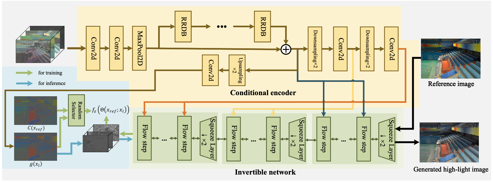

# [AAAI 2022] Low-Light Image Enhancement with Normalizing Flow
### [Paper](https://arxiv.org/pdf/2109.05923.pdf) | [Project Page](https://wyf0912.github.io/LLFlow/)

**Low-Light Image Enhancement with Normalizing Flow**
<br>_Yufei Wang, Renjie Wan, Wenhan Yang, Haoliang Li, Lap-pui Chau, Alex C. Kot_<br>
In AAAI'2022

## Overall


### Quantitative results
The evauluation results on LOL are as follows
| Method | PSNR | SSIM | LPIPS |
| :-- | :--: | :--: | :--: |
| LIME | 16.76 | 0.56 | 0.35 |
| RetinexNet | 16.77 | 0.56 | 0.47 |
| DRBN | 20.13 | 0.83 | 0.16 | 
| Kind | 20.87 | 0.80 | 0.17 |
| KinD++ | 21.30 | 0.82 | 0.16 |
| **LLFlow (Ours)** | **25.19** | **0.93** | **0.11** |

### Visual Results


## Get Started
### Dependencies and Installation
- Python 3.8
- Pytorch 1.9

1. Clone Repo
```
git clone https://github.com/wyf0912/LLFlow.git
```
2. Create Conda Environment
```
conda create --name LLFlow python=3.7
conda activate LLFlow
```
3. Install Dependencies
```
cd LLFlow
pip install -r requirements.txt
```

### Pretrained Model
We provide the pre-trained models with the following settings:
- A light weight model with promising performance trained on LOL [[Google drive](https://drive.google.com/file/d/1tukKu2KBZ_ohlQiLG4EKnrn1CAt_2F6G/view?usp=sharing)] with training config file `./confs/LOL_smallNet.yml`
- A standard-sized model trained on LOL [[Google drive](https://drive.google.com/file/d/1t3kASTRXbnEnCZ0EcIvGhMHYkoJ8E2C4/view?usp=sharing)] with training config file `./confs/LOL-pc.yml`.
- A standard-sized model trained on VE-LOL [[Google drive](https://drive.google.com/file/d/1n7XwIlNr1lUxgZ9qlmFXCwzMTWSStQIW/view?usp=sharing)] with training config file `./confs/LOLv2-pc.yml`.

### Test
You can check the training log to obtain the performance of the model. You can also directly test the performance of the pre-trained model as follows

1. Modify the paths to dataset and pre-trained mode. You need to modify the following path in the config files in `./confs`
```python
#### Test Settings
dataroot_GT
dataroot_LR
model_path
```
2. Test the model
```bash
python test.py --opt your_config_path
```
### Train
All logging files in the training process, e.g., log message, checkpoints, and snapshots, will be saved to `./experiments`.

1. Modify the paths to dataset in the config yaml files. We provide the following training configs for both `LOL` and `VE-LOL` benchmarks. You can also create your own configs for your own dataset.
```bash
.\confs\LOL_smallNet.yml
.\confs\LOL-pc.yml
.\confs\LOLv2-pc.yml
```
You need to modify the following terms 
```python
datasets.train.root
datasets.val.root
gpu_ids: [0] # Our model can be trained using a single GPU with memory>20GB. You can also train the model using multiple GPUs by adding more GPU ids in it.
```
2. Train the network.
```bash
python train.py --opt your_config_path
```
## Citation
If you find our work useful for your research, please cite our paper
```
@article{wang2021low,
  title={Low-Light Image Enhancement with Normalizing Flow},
  author={Wang, Yufei and Wan, Renjie and Yang, Wenhan and Li, Haoliang and Chau, Lap-Pui and Kot, Alex C},
  journal={arXiv preprint arXiv:2109.05923},
  year={2021}
}
```
## Contact
If you have any question, please feel free to contact us via yufei001@ntu.edu.sg.